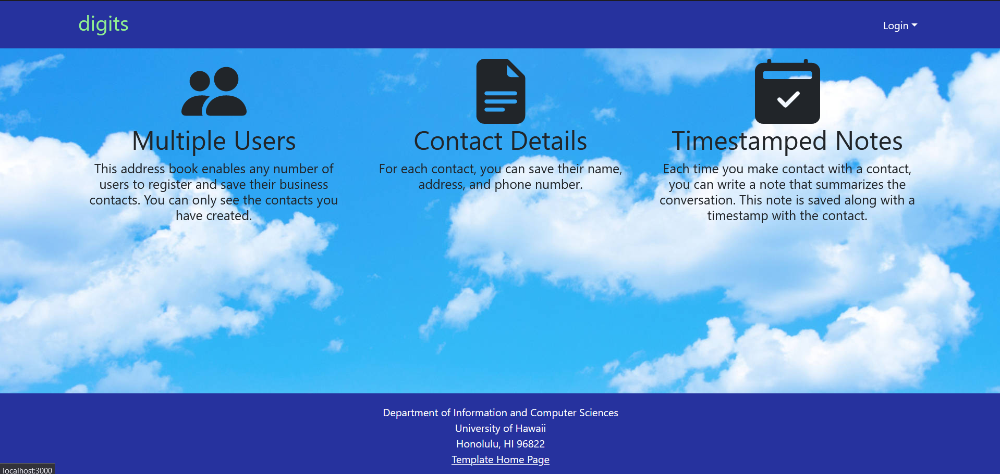

# Manoa Mentoring

## Table of Contents
* [Overview](#overview)
* [Mockup Pages](#mockup-pages)
* [Team](#team)

## Overview
Students at UH Manoa may encounter difficulties while studying, doing homework, or with their overall academic performance. There are a number of reasons why a student may be struggling, such as personal challenges or rigorous coursework, but one common issue is not having the proper resources to seek help.

Our application, Manoa Mentoring, aims to bring together students and mentors. Students can match themselves with other students who are facing similar issues, or they can choose a mentor who specializes in a subject or course they are taking. Through Manoa Mentoring, our goal is to create a space where students can not only receive the support they need, but also foster connections through mentorship and potential friendships.

## Mockup Pages

### Landing Page:

Welcome to our platform! Here, you'll find a vibrant community of learners dedicated to academic excellence. Our landing page showcases images of enthusiastic individuals engaged in studying, setting the tone for an interactive and collaborative learning experience. Get ready to explore our application, designed to enhance your educational journey.

### User Home Page:
Step into your personalized hub for learning. Our user home page offers tailored recommendations for study groups based on your interests, fostering connections with like-minded peers. Easily access your profile with a single click, where you can manage your information and preferences.

### Admin Home Page:
Admins, take charge of facilitating learning opportunities. From here, you can view and manage current study groups, ensuring a seamless experience for all users. Navigate effortlessly to a comprehensive display of user profiles, empowering you to support and guide the learning community effectively.

### User Profile Page:
Your profile, your identity. This page showcases your information in a user-friendly layout, complete with an edit button for easy updates. Much like the streamlined functionality of Digits, managing your profile has never been more straightforward.

### Edit Profile Page:
Fine-tune your details with ease on our edit profile page, reminiscent of the intuitive design of Digits. Update your information effortlessly, ensuring accuracy and relevance to your learning journey.

### Calendar Page:
Stay organized and informed with our dynamic calendar feature. Seamlessly integrated with Bootstrap components, our functional calendar allows users to view available study sessions based on admin (mentor) availability. Drawing inspiration from ICS 314 Calendar and STAR GPS, finding suitable study dates has never been more convenient.

### Create a Study Sesh Page:
Take control of your study sessions with our user-friendly creation tool. Specify details such as session time, topic, and class, empowering you to organize effective study gatherings tailored to your needs.

### Study Session Page:
Discover the perfect study session to elevate your learning experience. Utilize our search functionality to find sessions based on class, ensuring you never miss out on valuable collaborative study opportunities.

## Team
Manoa Mentoring is developed and maintained by Roger Tulonghari, Grace Madson, Hazelle Limos, Robert Maddox, and Hau'oli O'Brien.

Our organization can be found on [GitHub](https://github.com/manoa-mentoring), and the contract we created can be viewed [here](https://docs.google.com/document/d/1qXKbG2dNTEJKoSDvPZ3moOmphV2meq3-DvByIjZ7x2I/edit?usp=sharing).
