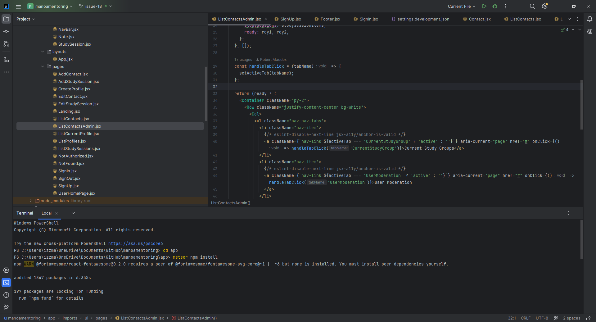

# Manoa Mentoring

## Table of Contents
* [Overview](#overview)
* [Deployment](#deployment)
* [User Guide](#user-guide)
* [Development History](#development-history)
* [Developer Guide](#developer-guide)
* [Continuous Integration](#continuous-integration)
* [Community Feedback](#community-feedback)
* [Team](#team)

## Overview
Students at UH Manoa may encounter difficulties while studying, doing homework, or with their overall academic performance. There are a number of reasons why a student may be struggling, such as personal challenges or rigorous coursework, but one common issue is not having the proper resources to seek help.

Our application, Manoa Mentoring, aims to bring together students and mentors. Students can match themselves with other students who are facing similar issues, or they can choose a mentor who specializes in a subject or course they are taking. Through Manoa Mentoring, our goal is to create a space where students can not only receive the support they need, but also foster connections through mentorship and potential friendships.

## Deployment
This application has been deployed to Digital Ocean and [can be found here](https://manoa-mentoring.site/).

## User Guide
### Landing Page

Welcome to our platform! Here, you'll find a vibrant community of learners dedicated to academic excellence. Our landing page showcases images of enthusiastic individuals engaged in studying, setting the tone for an interactive and collaborative learning experience. Get ready to explore our application, designed to enhance your educational journey.

### User Home Page

Step into your personalized hub for learning. Our user home page offers tailored recommendations for study groups based on your interests, fostering connections with like-minded peers. Easily access your profile with a single click, where you can manage your information and preferences.

### Admin Home Page

Admins, take charge of facilitating learning opportunities. From here, you can view and manage current study groups, ensuring a seamless experience for all users. Navigate effortlessly to a comprehensive display of user profiles, empowering you to support and guide the learning community effectively.

### User Profile Page

Your profile, your identity. This page showcases your information in a user-friendly layout, complete with an edit button for easy updates. Much like the streamlined functionality of Digits, managing your profile has never been more straightforward.

### Edit Profile Page

Fine-tune your details with ease on our edit profile page, reminiscent of the intuitive design of Digits. Update your information effortlessly, ensuring accuracy and relevance to your learning journey.

### Calendar Page

Stay organized and informed with our dynamic calendar feature. Seamlessly integrated with Bootstrap components, our functional calendar allows users to view available study sessions based on admin (mentor) availability. Drawing inspiration from ICS 314 Calendar and STAR GPS, finding suitable study dates has never been more convenient.

### Create a Study Sesh Page

Take control of your study sessions with our user-friendly creation tool. Specify details such as session time, topic, and class, empowering you to organize effective study gatherings tailored to your needs.

### Study Session Page

Discover the perfect study session to elevate your learning experience. Utilize our search functionality to find sessions based on class, ensuring you never miss out on valuable collaborative study opportunities.

## Development History
### Milestone 1: Mockup Development
For Milestone 1, we created mockup pages for the application and deployed the site to Digital Ocean.

This milestone is managed by the [Manoa Mentoring GitHub Project Board M1](https://github.com/orgs/manoa-mentoring/projects/1/views/1).

### Milestone 2: Additional Features and Data Model Development
For Milestone 2, we improved the application's functionalities by adding a calendar and a page to view available study pages. We continued the development of the data model, in which we implemented the proper Mongo Collections for the application's profiles and study sessions.

This milestone is managed by the [Manoa Mentoring GitHub Project Board M2](https://github.com/orgs/manoa-mentoring/projects/2).

### Milestone 3: Final Touches
For Milestone 3, we focused on finalizing the application by improving the user interface and implementing the leveling system. Each time a student or mentor performs an action on the site, such as joining a study session, the user earns experience points that is reflected on their profile.

This milestone is managed by the [Manoa Mentoring GitHub Project Board M3](https://github.com/orgs/manoa-mentoring/projects/4).

## Developer Guide
### Step 1: Clone the "manoamentoring" repo with GitHub Desktop [here](https://github.com/manoa-mentoring/manoamentoring).

### Step 2: Either create a branch to start working on or open the main branch in JetBrains IntelliJ Idea.

### Step 3: Navigate to the app folder in the terminal and run "meteor npm install"

### Step 4: Run "meteor npm run start" and open the app locally by clicking the localhost link in the terminal

### Bonus Step 5: The important folders are "api" and "ui". 
"api" contains necessary files for the various data structures the app uses like contacts, profiles, study sessions. Any further structures would be added here if needed. "ui" houses all of the app's visual elements and if you desire to change or add the appearance of any pages or components it will be done here.  

## Continuous Integration

GitHub Actions is used to automatically run ESLint and TestCafe whenever a commit is made to the main branch. This can be viewed at https://github.com/manoa-mentoring/manoamentoring/actions.

The corresponding workflow definition file is located at [.github/workflows/ci.yml](https://github.com/manoa-mentoring/manoamentoring/blob/main/.github/workflows/ci.yml).

## Community Feedback
We welcome feedback from the community! We are constantly looking for ways to improve our application and make it more user-friendly. Below is what some members of the UH Manoa community have said so far:

_"Certain wording on the site could be confusing for some. For example, having the "sign in" button next to the "sign up" button can cause mixups. It could be changed to "log in" instead. Also, when creating your profile, I wasn't sure what "image" meant. That could be changed to "profile picture" as well."_ --User 1

_"The links regarding study sessions could be placed into a dropdown menu. It looks a bit cluttered with separate links on the Navbar. Profile pictures should be uploaded using files instead of links."_ --User 2

_"I wasn't quite sure what to do after registering for a session. There wasn't a link or session confirmation, other than a message saying that you did. If the website displays a page with details about your registered study session, such as Zoom links, that would be helpful. I think it should also lead to the calendar page, so I could visually see when the session is._ --User 3

_"I would definitely use this site to help with my studies. While it's still in the early ages, I think it already has useful functions, such as the study session finder. If there was a chat function to contact other students or mentors, it would be easier to set up a study session."_ --User 4

_"I like the colors and UI design of the site. It seems quite organized, since I can clearly see where to view profiles and study sessions. I would be interested in using it."_ --User 5

## Team
Manoa Mentoring is developed and maintained by Roger Tulonghari, Grace Madson, Hazelle Limos, Robert Maddox, and Hau'oli O'Brien.

Our organization can be found on [GitHub](https://github.com/manoa-mentoring) with all the repos [here](https://github.com/orgs/manoa-mentoring/repositories), and the contract we created can be viewed [here](https://docs.google.com/document/d/1qXKbG2dNTEJKoSDvPZ3moOmphV2meq3-DvByIjZ7x2I/edit?usp=sharing).
